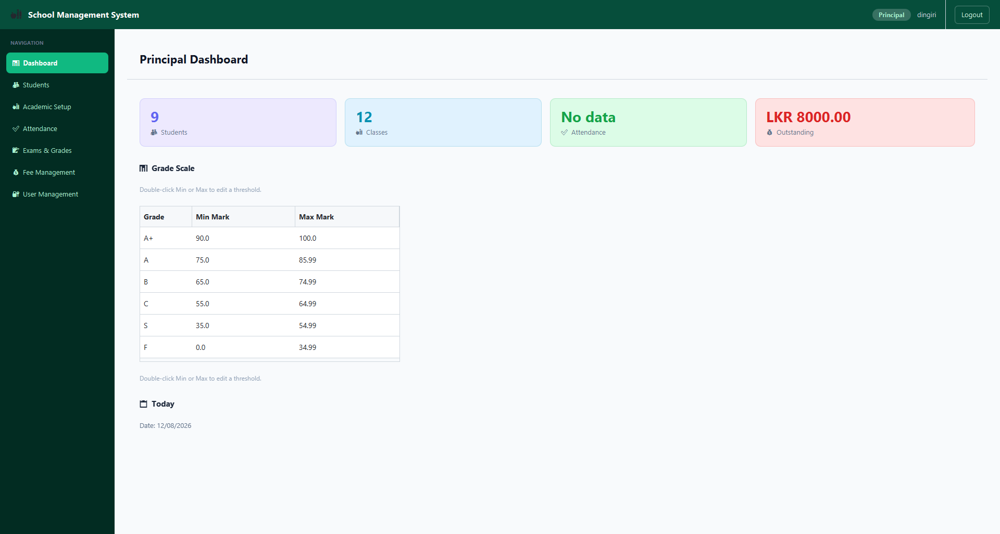
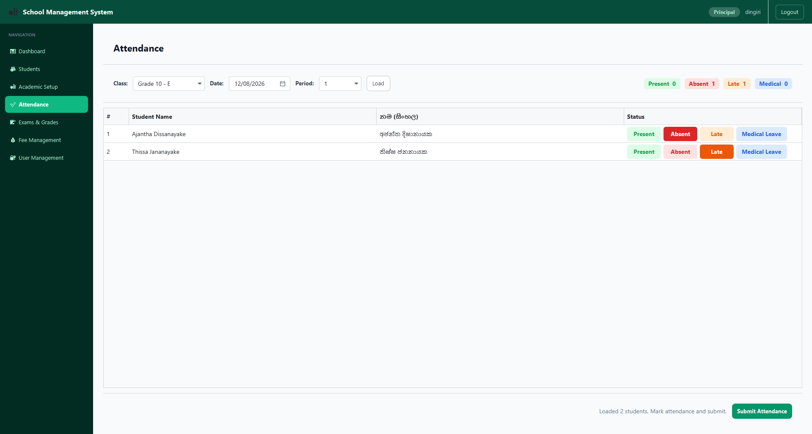
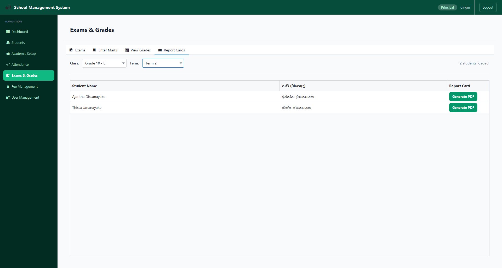
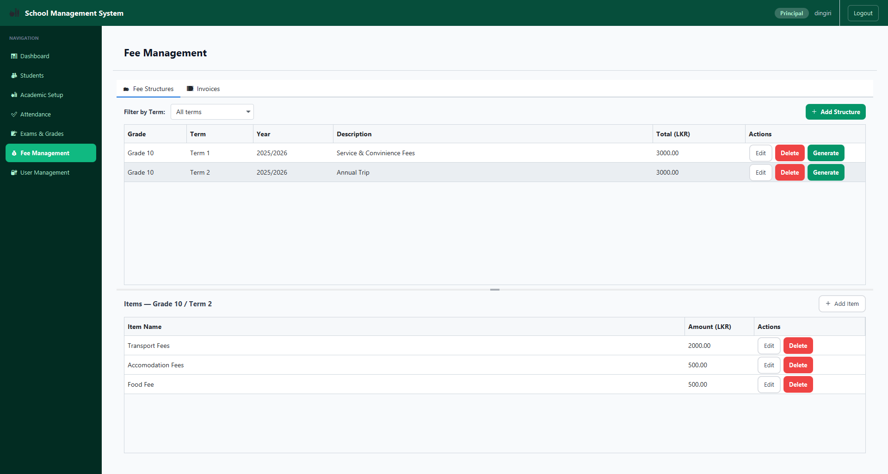
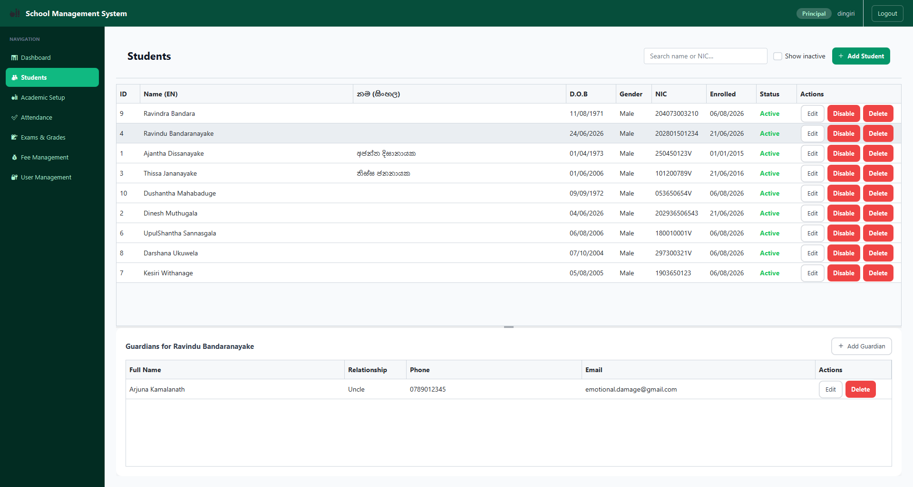
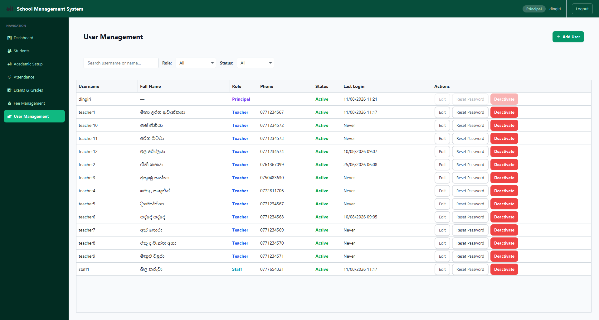
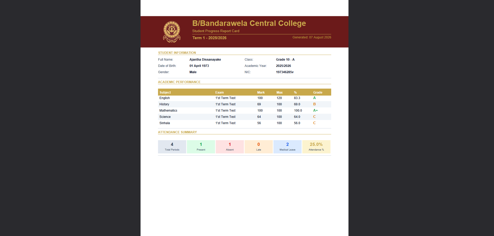

# School Management System

A Java desktop application for managing single-school administrative operations — built as a university project for semester 2 subjects.


## Overview

School Management System replaces manual, paper-based school administration with a role-based desktop application. Three user roles — **Principal**, **Teacher**, and **Office Staff** — each get a tailored dashboard and feature set covering the full academic and administrative lifecycle: student registration, attendance, exams and grading, timetabling, fee management, and PDF report card generation.

## Features

- 🔐 Role-based authentication with BCrypt password hashing
- 👥 Student & guardian registration with Sinhala Unicode support
- 🏫 Academic structure setup — years, terms, classes, subjects, teacher assignments, enrollment
- ✅ Period-level attendance marking (Present / Absent / Late / Medical Leave)
- 🗓 Configurable school timetable with adjustable bell schedule
- 📝 Examination management with automatic grade calculation
- 💰 Fee structures, bulk invoice generation, and payment tracking
- 🖨️ PDF report card generation per student per term
- 📊 Real-time dashboards for each role

## Tech Stack

| Layer | Technology |
|---|---|
| Language | Java 17 |
| UI | JavaFX 21.0.2 |
| Database | MySQL 8.x |
| Build Tool | Apache Maven |
| Password Hashing | jBCrypt |
| PDF Generation | Apache PDFBox 3.0.2 |
| Theme | [AtlantaFX](https://github.com/mkpaz/atlantafx) |

## Architecture

The application follows the **MVC pattern** with a dedicated DAO layer:

com.school<br>
├── model/ — Domain entities (Student, Attendance, Invoice, etc.)<br>
├── dao/ — Database access objects, one per table group<br>
├── controller/ — JavaFX controllers, one per view<br>
├── service/ — `ReportCardService` (PDF generation)<br>
└── util/ — `DBConnection`, `SessionManager`


FXML views live under `src/main/resources/com/school/fxml/`.

## Database Schema

22 tables across 6 groups (Auth, People, Academic Structure, Attendance/Timetable, Exams, Fees) plus 4 computed views. Full schema: [`school_management_schema.sql`](./school_management_schema.sql).

## Getting Started

### Prerequisites
- JDK 17+
- MySQL 8.x
- Maven 3.11+

### Setup

1. **Clone the repo**
```bash
   git clone https://github.com/DingiriNaide/School-System.git
   cd School-System
```

2. **Create the database**
```bash
   mysql -u root -p < school_management_schema.sql
```

3. **Generate BCrypt password hashes** for the seed users (`principal`, `teacher1`, `staff1`). Run a throwaway snippet:
```java
   System.out.println(BCrypt.hashpw("YourPassword", BCrypt.gensalt(12)));
```
   Then update the `users` table:
```sql
   UPDATE users SET password_hash = '<hash>' WHERE username = 'principal';
```

4. **Configure database connection** — edit `src/main/resources/db.properties`:
```properties
   db.url=jdbc:mysql://localhost:3306/school_management
   db.user=root
   db.password=yourpassword
```

5. **Run the application**
```bash
   mvn javafx:run
```

## Project Structure

school-system/<br>
├── src/main/java/com/school/<br>
├── src/main/resources/com/school/<br>
│   ├── fxml/<br>
│   ├── css/<br>
│   └── images/<br>
├── school_management_schema.sql<br>
├── pom.xml<br>
└── README.md<br>


## Screenshots










## Documentation

- [Software Requirements Specification](./docs/SRS.odt)
- [Database Report](./docs/DB_Report.odt)
- [ER Diagram](./docs/ER-Diagram.pdf)
- [Class Diagram](./docs/class-diagram.svg)
- [Use Case Diagram](./docs/use-case-diagram.svg)
- [Activity Diagrams](./docs/activity-diagrams/)

## Known Limitations

- PDF report cards do not currently support Sinhala Unicode text (Apache PDFBox built-in fonts are Latin-1 only)
- No web/mobile access — desktop only
- Designed for single-school use; no multi-tenancy

## License

This project was developed for academic purposes as part of BSc (Hons) Software Engineering, Semester 2 Final Project for Lanka Nippon BizTech Institute.

## Author

**Amila Senadheera**
UGC0725003
